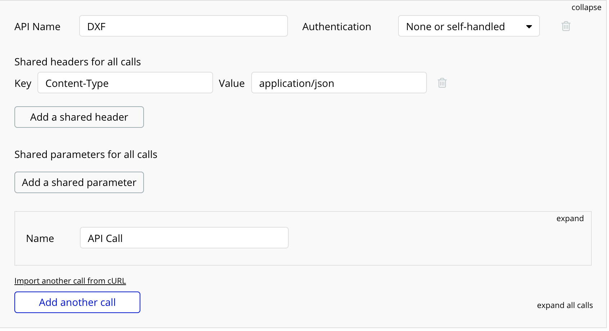
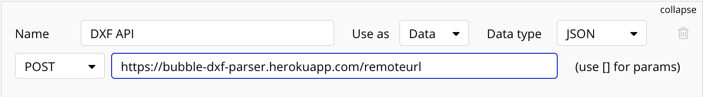
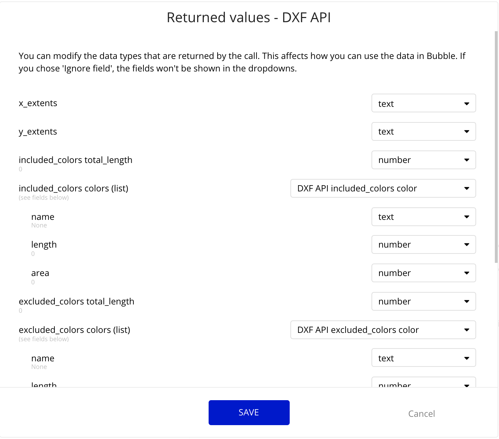
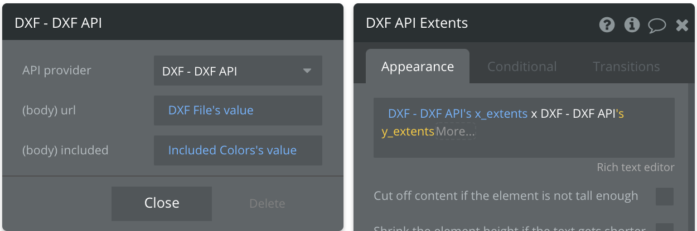
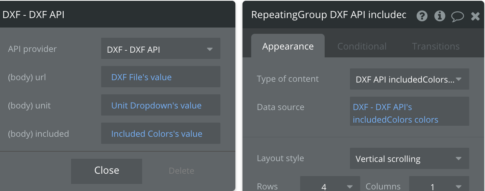
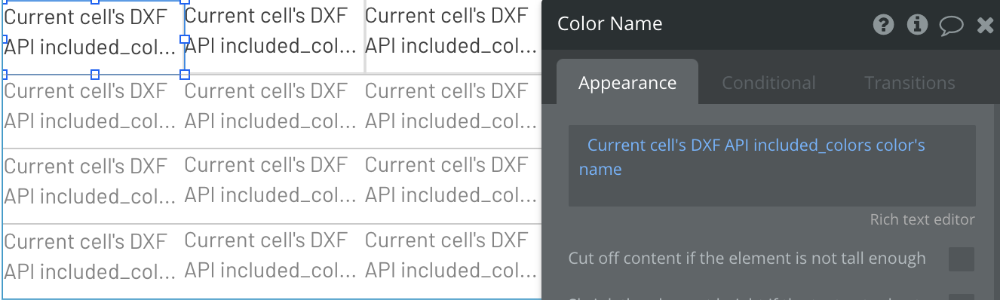
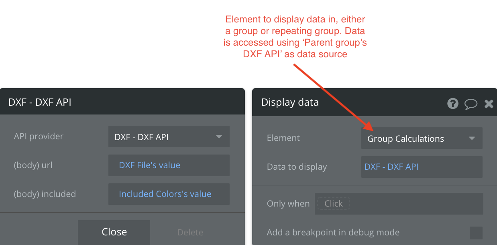

## DXF API JSON Output

The DXF API is a function that receives 3 parameters:
* Remote file url for DXF
* Unit value (in, cm, mm, etc.)
* Included Colors (color code and names both work)

Here is a preview of what an example output looks like:

```
{
    "includedColors": {
        "colors": [
            {
                "name": "LIME",
                "length": 72.333,
                "area": 282.869
            }
        ],
        "totalLength": 72.333
    },
    "excludedColors": {
        "colors": [
            {
                "name": "Empty",
                "length": 0,
                "area": 0
            }
        ],
        "totalLength": 0
    },
    "image": "Base64 Encoded Image text here",
    "extents": "28.977in x 12.727in",
    "unSupportedTypes": "none",
    "missingColors": "none",
    "message": "Success!"
}
```
The output has 7 different keys:
* includedColors
* excludedColors
* image
  * Base64 Encoded Image text representing the DXF file
* extents
  * DXF file extents with unit parameter if given
* unsupportedTypes
  * Text representing any entities not covered by the DXF parser
  * Currently covers LINE, POLYLINE, LWPOLYLINE, SPLINE, CIRCLE, ELLIPSE, and ARC types
* missingColors
  * Text representing any colors missing from the included parameter
* message
  * Text displaying API status

The includedColors and excludedColors keys are a nested JSON object and have **2** child keys each, **colors** which denotes a list of colors with their name and length/area calculations and **totalLength** which denotes the sum length of entities represented in the colors key.

## API Connector

First, you need to install the API Connector plugin in bubble. Go to the Plugins tab -> + Add Plugins -> search for API Connector and install.

Upon installing you need to initialize an API call so Bubble knows what types of data it's returning. This can be done in the Plugins tab when you click on API Connector. Go ahead and click on 'Add another API'.

We need to first define an API and give it a name, let's call it DXF. Click on 'Add a shared header' to add a header for the type of data being returned, in this case, an application/json type. Your API should look like this now:


Once we've defined the API, we need to add a call which is essentially a function that will take parameters and return the important data that we need. Let's rename API call to DXF API and expand the box. Our API call is a POST API meaning we send data to the server and create a resource, our return JSON. Set the request type from GET to POST. Our API url resides on 'https://bubble-dxf-parser.herokuapp.com/remoteurl', so fill the box next to it with that. It should look like this now:


We now need to fill in the parameters being sent to the API call so head towards the 'Body' box to add our 3 inputs: url, unit, and included.
```
{
    "url": "https:<url>",
    "unit": "<unit>",
    "included": "<included>"
}
```
These parameters are defined in a JSON format where each line is a key/value pair (key is on the left of the colon and value is on the right). For example, the "url" key points to a value of "https:<url>". Make sure to enclose keys and values with quotes to follow the JSON schema.  

Each of these values are enclosed in "<>" which means the value is dynamic, so we can set the value to whatever we want in the Bubble app (use a Bubble element value to fill the value). The "url" key looks different since Bubble uploads files and returns the file location as "//s3.amazonaws.com/filestuff.dxf". The "https:" placed at the front just makes it a valid url.

**Make sure to uncheck the private box for all key/value pairs**. At this point, the API call is finished being defined and your API should look like this:


Go ahead and initialize the call by pressing "Initialize call" at the bottom and your API is now defined on Bubble!


## Using API call in Bubble
* ### Example external API call for extents on Text Box:
To grab data from the API, simply insert dynamic data -> Get data from an external API -> choose 'DXF - DXF API' as the API provider -> fill in the parameters -> use extents. It should look like this:


* ### Example external API call on Repeating Group:
We'll use the same approach as the text box example. Set the Data Source first by: Get data from an external API -> choose 'DXF - DXF API' as the API provider -> fill in the parameters -> use colors.We then choose the Type of Content, either 'DXF API includedColors color' or 'DXF API excludedColors color' depending on what you need. It should look like this:

 .   
includedColors color will be a list of color calculations with fields name, length, and area data. You can display these in your Repeating Group with 3 text boxes representing each field like so:


* ### Example external API call for Button/Workflow:
First add a workflow for the button press. We can display the API data using Element Actions -> Group/Display-data or Repeating-Group/Display-list. It works the same as above, Data to Display will be: Get data from an external API -> choose 'DXF - DXF API' as the API provider -> fill in the parameters. It should look like this:

